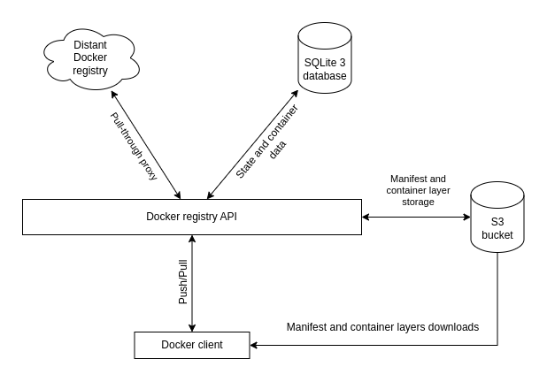

# Docker container registry and proxy API

his project aims to implement a [Docker Registry HTTP API](https://docs.docker.com/registry/spec/api/) that can also act as a proxy to other registries with a dedicated path for that purpose. In other words, it's a storage for your own Docker images and a cache for others. If you're using GitLab, this will probably remind you of the Container Registry and the Dependency Proxy.

**Note: This project is not production-ready and should be used at your own risk !**

## Repository architecture

## Why not [Docker's Go implementation](https://github.com/distribution/distribution/) of the registry ?

While installing the registry was a breeze, I can't make it work as a pull-through registry and a storage registry **at the same time**. It's either one, or the other. While I could set up another registry (pretty much automated with Ansible), that would mean grabbing another TLS certificate, setting up another subdomain and configure the HTTP reverse proxy appropriately. Let alone configuring the HTTP reverse-proxy to use only one domain.

## Current limitations
Implementing the entire [Docker Registry HTTP API V2 specification](https://docs.docker.com/registry/spec/api/) is not really the final goal of the project. As long as I can push and pull images with the `docker` client and the [Kaniko container builder](https://github.com/GoogleContainerTools/kaniko), I will be fine.

While uploads are more or less cleaned after, the files stored on the S3 bucket are not. Cleaning manifests and pruning will be implemented whenever the storage on my side is close to being out of control, or earlier. In other words, deleting a file from the S3 storage while keeping the database as is **WILL BREAK** the repository for that container.

## License

Copyright 2022 Mathias B. <contact@l4p1n.ch>

Licensed under the Apache License, Version 2.0 (the "License");
you may not use this file except in compliance with the License.
You may obtain a copy of the License at

       http://www.apache.org/licenses/LICENSE-2.0

Unless required by applicable law or agreed to in writing, software
distributed under the License is distributed on an "AS IS" BASIS,
WITHOUT WARRANTIES OR CONDITIONS OF ANY KIND, either express or implied.
See the License for the specific language governing permissions and
limitations under the License.
